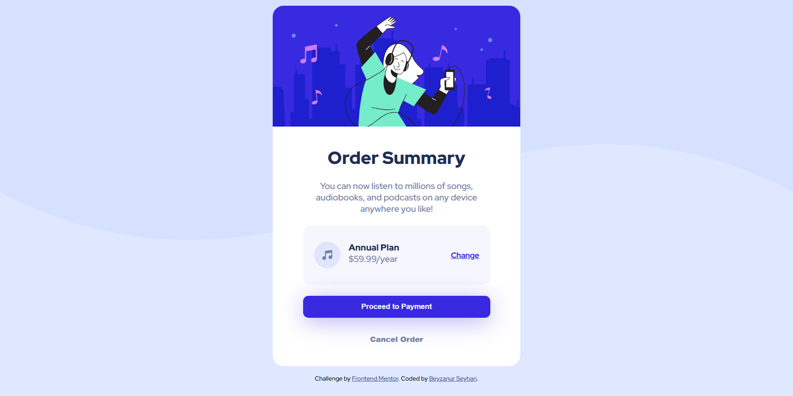

# Frontend Mentor - Order summary card solution

This is a solution to the [Order summary card challenge on Frontend Mentor](https://www.frontendmentor.io/challenges/order-summary-component-QlPmajDUj). Frontend Mentor challenges help you improve your coding skills by building realistic projects. 

## Table of contents

- [Overview](#overview)
  - [Screenshot](#screenshot)
  - [Links](#links)
- [My process](#my-process)
  - [Built with](#built-with)
  - [What I learned](#what-i-learned)
  - [Useful resources](#useful-resources)
- [Author](#author)
- [Acknowledgments](#acknowledgments)

## Overview

### Screenshot
#### Desktop


#### Mobile


### Links

- Solution URL: [Add solution URL here](https://your-solution-url.com)

## My process

### Built with

- CSS custom properties
- Flexbox
- CSS Grid

### What I learned

- I repeated the logic of the css flex structure. In this way, I re-examined this issue that I had forgotten.
- The feature that combines justify-content and align-items features (used with flex-layout)

```css
body {
  place-content: center;
}
```

## Developer

- Website - [Beyzanur Seyhan](https://beyzanurseyhan.com/)
- Frontend Mentor - [@beyzanur-seyhan](https://www.frontendmentor.io/profile/beyzanur-seyhan)
- Linkedin - [@beyzanurseyhan](https://www.linkedin.com/in/beyzanurseyhan/)
- E-Mail - [info@beyzanurseyhan.com](mailto:info@beyzanurseyhan.com)

## Acknowledgments

I would like to thank the Front End Mentor website for offering this and similar projects free of charge to expand my portfolio.

